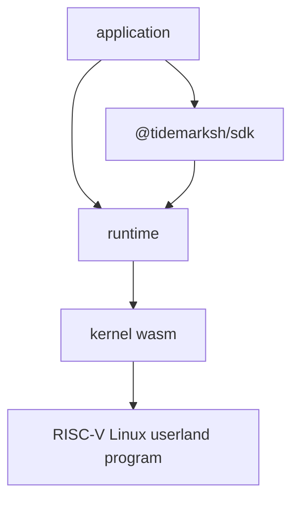

# Tidemark

Tidemark is a browser-hosted RISC-V Linux userland environment.

It lets applications run command-line tools, language runtimes, package-backed
file layers, and terminal-style workflows inside WebAssembly and browser worker
infrastructure.

## Repositories

| Repository | Role |
|---|---|
| [`kernel`](https://github.com/tidemarksh/kernel) | RISC-V execution, ELF loading, Linux userland syscalls, memory, filesystem, process, thread, signal, pipe, and socket behavior. |
| [`runtime`](https://github.com/tidemarksh/runtime) | Browser and Node worker orchestration around the kernel WebAssembly module, including process lifecycle, stdio, filesystem snapshots, and host bridge integration. |
| [`sdk`](https://github.com/tidemarksh/sdk) | Application-facing API for creating runtimes, applying file layers, running commands, installing package layers, and attaching terminals. |
| [`docs`](https://github.com/tidemarksh/docs) | Public architecture and compatibility documentation. |

## Architecture

Tidemark separates guest-visible semantics from host orchestration and product
policy.

The kernel owns Linux/RISC-V compatibility behavior. The runtime owns worker
lifecycle, state movement, stdio, filesystem snapshots, and host bridge plumbing.
The SDK owns application ergonomics, package providers, and integration helpers.

## Status

Tidemark is under active development. The current implementation focuses on
browser-compatible Linux userland execution rather than a full virtual machine
monitor or browser operating system.

## License

See each repository for its license.
