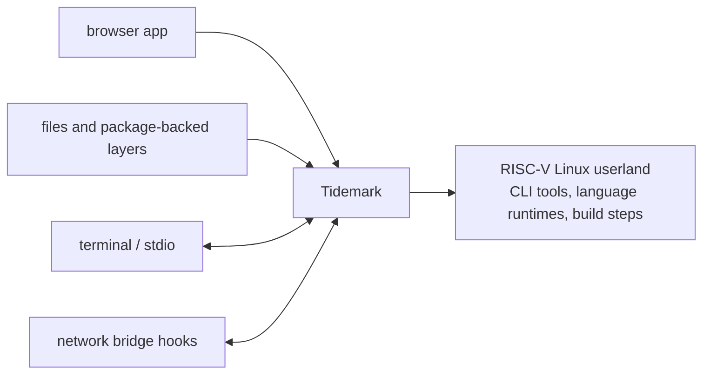

# Tidemark

Tidemark is a browser-hosted RISC-V Linux userland environment.

It lets applications run command-line tools, language runtimes, package-backed
file layers, and terminal-style workflows inside WebAssembly and browser worker
infrastructure.

## Repositories

| Repository | Role |
|---|---|
| [`kernel`](https://github.com/tidemarksh/kernel) | RISC-V execution, ELF loading, Linux userland syscalls, memory, filesystem, process, thread, signal, pipe, and socket behavior. |
| [`runtime`](https://github.com/tidemarksh/runtime) | Browser and Node worker orchestration around the kernel WebAssembly module, including process lifecycle, stdio, filesystem snapshots, and host bridge integration. |
| [`sdk`](https://github.com/tidemarksh/sdk) | Application-facing API for creating runtimes, applying file layers, running commands, installing package layers, and attaching terminals. |
| [`docs`](https://github.com/tidemarksh/docs) | Public architecture and compatibility documentation. |

## Architecture

Tidemark is an application-embedded guest execution environment for browser and
worker hosts. It is not just CPU emulation: it combines guest execution,
filesystem state, process orchestration, stdio, network bridge hooks, and
SDK-level provisioning.

For repository boundaries and the full system model, see the
[Tidemark architecture documentation](https://tidemarksh.github.io/docs/).

## License

See each repository for its license.
